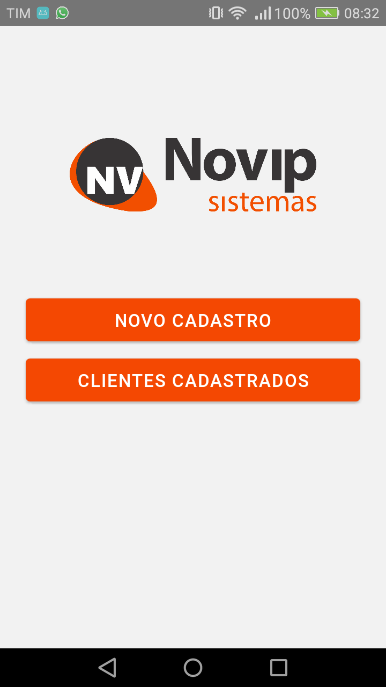

# Descrição

Criar um App de cadastro de pessoas que irá rodar em clientes de SC e do PR.
A UF do cliente, onde o sistema estará rodando, deve ser definida numa configuração.
O cadastro deverá conter os seguintes campos:

<ul>
  <li>Nome</li>
  <li>CPF</li>
  <li>Data/hora de cadastro</li>
  <li>Data de nascimento</li>
  <li>Telefones. O número de telefones é variável.</li>
</ul>
Regras:
Caso o cliente seja de SC, também é necessário cadastrar o RG.
Caso seja do PR, não deixar cadastrar uma pessoa com menos de 18 anos.
Criar também um relatório de clientes cadastrados (pode apenas ser gerado em tela),
com filtros por nome, data de cadastro e data de nascimento.

# Technologias

<ul>
  <li>Typescript</li>
  <li>React Native</li>
  <li>Axios</li>
  <li>Styled Components</li>
</ul>

# Screenshots

Home screen:

  

Screen de seleção de estados:

  

Criar um cadastro para o Paraná:

  

Criar um cadastro para Santa Catarina:

  

Screen de clientes com dados vindos de um Rest Api:

  

